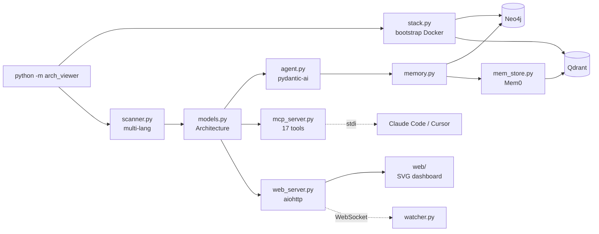

<div align="center">

# arch-viewer

### MCP-native architecture viewer with AI-powered codebase analysis

[](https://opensource.org/licenses/MIT)
[](https://www.python.org/downloads/)
[](https://modelcontextprotocol.io/)
[](https://www.anthropic.com/)
[](CONTRIBUTING.md)

</div>

Point arch-viewer at any codebase and get a living, AI-curated map of how it actually fits together. It scans your project, runs structured analysis through pydantic-ai, persists the result into a Neo4j knowledge graph, exposes 17 MCP tools to any MCP client (Claude Code, Cursor, your own agent), and serves a vanilla-JS dashboard with an interactive SVG architecture diagram you can hand to anyone. No SaaS, no telemetry, all local.

---

## Why arch-viewer?

- **vs. Mermaid / PlantUML** — those are static diagrams you hand-write and forget. arch-viewer regenerates the picture every time your code changes, then asks an LLM to caption what it sees.
- **vs. Structurizr / C4 tooling** — Structurizr makes you author DSL by hand. arch-viewer derives components, data flows, and tech stack directly from AST analysis and lets you correct it; corrections persist into a memory store and shape future runs.
- **vs. Sourcegraph / CodeSee** — those are hosted, paid, and need to ingest your code in their cloud. arch-viewer is MIT-licensed, runs entirely on localhost (Neo4j + Qdrant in Docker, LLM call to the provider of your choice), and is free.

---

## Demo

> Screenshots live in [`docs/screenshots/`](docs/) — drop your own in to replace the placeholders below.


*Live dashboard at `http://localhost:3777` — file tree, architecture score, AST analysis, AI summary, editor.*


*Standalone HTML diagram produced by the `generate_interactive_diagram` MCP tool — pan, zoom, click a node to see its files and routes.*

---

## Quick start

```bash
git clone https://github.com/axumquant/arch-viewer
cd arch-viewer
pip install -e .
python -m arch_viewer --web /path/to/your/project
```

Open `http://localhost:3777`. On first launch you'll be prompted for an LLM API key (OpenAI, Anthropic, Groq, or Ollama Cloud).

> Docker Desktop must be running. arch-viewer auto-starts a local Neo4j and Qdrant container the first time it boots and waits for them to be healthy before serving requests.

---

## Features

- **Multi-language scanner** — Python, JavaScript, TypeScript, Go, Rust, Java, and more. Discovers components, dependency files, API routes, and entry points.
- **AI architecture analysis** via [pydantic-ai](https://ai.pydantic.dev/) — structured `ArchitectureSummary` output from OpenAI, Anthropic, Groq, or Ollama Cloud.
- **17 MCP tools** — drop into Claude Code, Cursor, or any MCP client and ask the model about your codebase directly.
- **Neo4j knowledge graph** — every component, dependency, and data flow is upserted per project. Browse it at `http://localhost:7474`.
- **Mem0 semantic memory** — corrections and patterns you teach the AI persist into Qdrant, scoped per project, and are re-injected before each analysis.
- **Standalone interactive HTML diagrams** — single self-contained file, pure SVG, no framework. Open it in any browser, ship it to a stakeholder, embed it in docs.
- **Live file watching** — WebSocket-pushed updates to the dashboard whenever a file changes.
- **Built-in code editor** with CodeMirror 6 syntax highlighting for Python, JS/TS, Go, Rust, JSON, YAML, Markdown.
- **Architecture health score** (0–100) across Modularity, Code Quality, Maintainability, and Structure, with anti-pattern detection (circular imports, god files, orphaned modules, etc.).

---

## Prerequisites

- **Python 3.11+**
- **Docker Desktop** (running) — for the Neo4j + Qdrant stack, auto-bootstrapped on first launch
- **At least one LLM API key** — OpenAI, Anthropic, Groq, or Ollama Cloud

---

## Installation

### Option A — Quick (Docker stack + local Python)

```bash
git clone https://github.com/axumquant/arch-viewer
cd arch-viewer
docker compose up -d neo4j qdrant
pip install -e .
python -m arch_viewer --web
```

### Option B — Development

```bash
git clone https://github.com/axumquant/arch-viewer
cd arch-viewer
pip install -e ".[dev]"
docker compose up -d neo4j qdrant
pytest
python -m arch_viewer --web
```

### Option C — MCP integration with Claude Code

Add to `.claude/settings.json` (or `~/.claude/settings.json` for a global server):

```json
{
  "mcpServers": {
    "arch-viewer": {
      "command": "python",
      "args": ["-m", "arch_viewer"],
      "env": {
        "ARCH_VIEWER_ROOT": ".",
        "ARCH_VIEWER_PROVIDER": "anthropic"
      }
    }
  }
}
```

Restart Claude Code. The 17 arch-viewer tools will appear under the MCP servers list.

---

## Configuration

| Env var | Default | Description |
|---|---|---|
| `ARCH_VIEWER_ROOT` | `cwd` | Project root directory to scan |
| `ARCH_VIEWER_PROVIDER` | auto-detect | LLM provider: `openai`, `anthropic`, `groq`, `ollama` |
| `ARCH_VIEWER_MODEL` | provider default | Model name override |
| `ARCH_VIEWER_PORT` | `3777` | Web dashboard port |
| `ARCH_VIEWER_NO_AI` | unset | Set to `1` to disable AI analysis (static scan only) |
| `OPENAI_API_KEY` | — | OpenAI API key |
| `ANTHROPIC_API_KEY` | — | Anthropic API key |
| `GROQ_API_KEY` | — | Groq API key |
| `OLLAMA_API_KEY` | — | Ollama Cloud API key |
| `NEO4J_URI` | `bolt://localhost:7687` | Neo4j bolt endpoint |
| `NEO4J_USER` | `neo4j` | Neo4j username |
| `NEO4J_PASSWORD` | `archviewer123` | Neo4j password (override in production) |
| `QDRANT_URL` | `http://localhost:6333` | Qdrant REST endpoint |
| `MEM0_ENABLED` | `1` | Set to `0` to skip semantic memory |

Per-project API keys are persisted at `<project>/.arch_viewer/keys.json` (gitignored).

---

## MCP tools

All 17 tools are registered in [`arch_viewer/mcp_server.py`](arch_viewer/mcp_server.py).

| Tool | Description |
|---|---|
| `get_architecture` | Complete architecture model — components, data flows, tech stack, stats, AI summary |
| `get_component` | Detailed info on a single component (files, routes, tech, description) |
| `get_data_flows` | How components connect — protocol and direction |
| `get_dependencies` | Project dependencies, filterable by category (`python`, `node-runtime`, `node-dev`) |
| `get_file_tree` | Nested file tree, optionally filtered by path prefix |
| `get_ai_summary` | AI-generated narrative of the architecture |
| `get_api_routes` | All detected HTTP/WS routes across components |
| `get_architecture_score` | 0–100 score across Modularity, Code Quality, Maintainability, Structure |
| `get_dependency_graph` | Import / call / package / component graph with hotspot analysis |
| `get_anti_patterns` | Severity-ranked findings: circular imports, god files, orphaned modules, etc. |
| `analyze_file_ast` | Functions, classes, imports, exports, and complexity for a single file |
| `get_recent_changes` | Recent file changes from the live watcher |
| `refresh_architecture` | Force a full rescan and AI re-analysis |
| `get_memory` | All learned patterns, corrections, and analysis history |
| `add_memory_pattern` | Teach the AI a new project-specific pattern |
| `add_memory_correction` | Correct a past AI mistake — applied to future analyses |
| `generate_interactive_diagram` | Write a standalone interactive HTML diagram to disk |

---

## Usage examples

### Scan from the CLI

```bash
# Live dashboard + MCP server (default)
python -m arch_viewer /path/to/project

# Dashboard only, custom port, no AI
python -m arch_viewer --web --port 4000 --no-ai /path/to/project

# One-shot JSON dump
python -m arch_viewer --scan /path/to/project > architecture.json
```

### Call an MCP tool from Claude Code

Once arch-viewer is registered in `settings.json`, in Claude Code:

> Use arch-viewer to show me the architecture score for this repo and list any anti-patterns ranked by severity.

Claude will invoke `get_architecture_score` and `get_anti_patterns` and explain the result.

### Generate a standalone diagram

```python
# Inside an MCP-enabled session, or via the REST API
POST /api/refresh
# then ask the agent:
# "Use generate_interactive_diagram with output_path=docs/architecture.html"
```

The output is a single `.html` file with embedded SVG, JS, and CSS — share it via email, embed it in a wiki, commit it to your docs folder.

---

## Architecture



- **Scanner** does AST + regex extraction across supported languages.
- **Agent** wraps pydantic-ai with structured `ArchitectureSummary` output.
- **Memory** is a three-tier write: flat JSON → Neo4j graph → Mem0 semantic store.
- **MCP server** exposes the same model surface as the web dashboard, both backed by a single `Architecture` instance.

---

## Tech stack

- **Python** 3.11+
- **mcp** ≥ 1.0 (Model Context Protocol SDK)
- **pydantic-ai** ≥ 0.0.30
- **pydantic** ≥ 2.9
- **aiohttp** ≥ 3.10 (web server + WebSockets)
- **watchdog** ≥ 4.0 (file change detection)
- **neo4j** ≥ 5.20 (knowledge graph)
- **mem0ai** ≥ 0.1.50 (semantic memory)
- **qdrant-client** ≥ 1.9 (vector store)
- **openai** ≥ 1.50 (provider SDK)
- Vanilla JS + SVG + CodeMirror 6 in the dashboard — no React, no build step

---

## Roadmap

These are planned, not built. Open an issue if you want to drive one.

- [ ] In-browser graph editing — edit Neo4j nodes/edges from the dashboard
- [ ] Additional LLM providers — Gemini, Mistral, xAI Grok, AWS Bedrock
- [ ] Cytoscape.js alternate renderer for very large graphs (10k+ nodes)
- [ ] GitHub Action that auto-generates `docs/architecture.html` on every PR
- [ ] VS Code extension that surfaces the dashboard in a side panel
- [ ] Multi-repo aggregation — one dashboard across a monorepo or org
- [ ] `arch-viewer diff` — semantic diff between two revisions of an architecture

---

## Contributing

PRs, issues, and discussions are very welcome. See [CONTRIBUTING.md](CONTRIBUTING.md) for setup, code style, and PR conventions. By participating you agree to abide by the [Code of Conduct](CODE_OF_CONDUCT.md).

- **Bug reports** → [Issues](https://github.com/axumquant/arch-viewer/issues/new/choose)
- **Questions / ideas** → [Discussions](https://github.com/axumquant/arch-viewer/discussions)
- **Security** → see [SECURITY.md](SECURITY.md)

---

## License

[MIT](LICENSE) © AxumQuant

---

## Built by

[AxumQuant](https://github.com/axumquant) — a small open-source lab building developer tools around MCP, knowledge graphs, and agentic workflows. Contact via [GitHub issues](https://github.com/axumquant/arch-viewer/issues).

---

## Acknowledgements

- [Anthropic](https://www.anthropic.com/) for the [Model Context Protocol](https://modelcontextprotocol.io/) spec and SDK
- [Neo4j](https://neo4j.com/) for the community-edition graph database
- [Mem0](https://mem0.ai/) for the semantic memory layer
- [pydantic-ai](https://ai.pydantic.dev/) for typed LLM agents
- [Qdrant](https://qdrant.tech/) for the vector store
- [CodeMirror](https://codemirror.net/) for the in-browser editor
